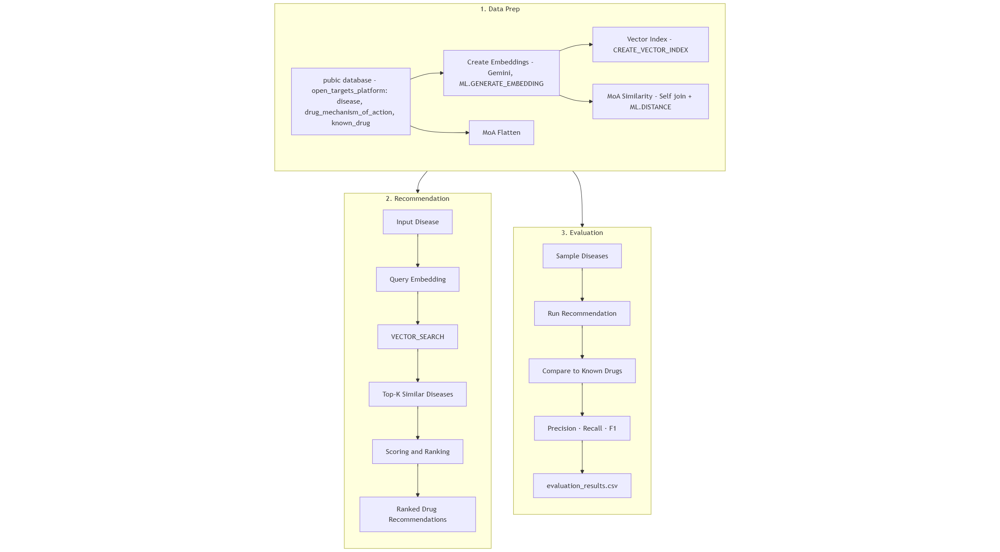
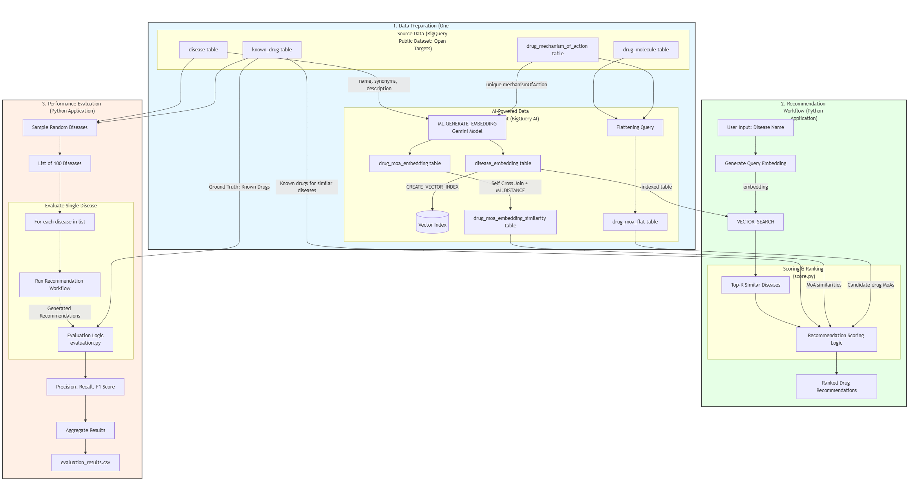

# ReDrugAI - Drug Repurposing Recommendation System
## Overview

**ReDrugAI** is an AI-powered drug repurposing recommendation system built on Google BigQuery and BigQuery AI. The system leverages machine learning embeddings and vector similarity search to identify potential therapeutic applications for existing drugs in new disease contexts.

## Python Dependencies

- **Python**: Version >= 3.12.7
- **Dependencies**: Install required packages from `requirements.txt`

## Architecture Diagram 

*Simple overview of the ReDrugAI system architecture showing the main data flow and components*

*Complex detailed view of the system architecture including all technical components, data processing pipelines, and AI model interactions*

## Core Components
### `main.ipynb`
**The main project file** - A comprehensive Jupyter notebook that provides complete explanation and step-by-step implementation of the ReDrugAI system:
- **Prepare Table**: Data preprocessing, embedding table creation with vector index, and similarity matrix construction for drug-disease relationships
- **Vector Search**: Implementation of embedding-based similarity search for drug recommendations
- **Performance Evaluation**: Comprehensive testing and validation of recommendation accuracy

### `score.py`
Main recommendation engine containing:
- `recommend_for_disease_with_similars()`: Primary recommendation function
- MOA similarity scoring algorithms
- Drug candidate filtering and ranking

### `evaluation.py`
Evaluation framework featuring:
- `run_disease_evaluation()`: Single disease evaluation
- `calculate_evaluation_metrics()`: Precision/recall calculation
- Leave-one-out cross-validation methodology

