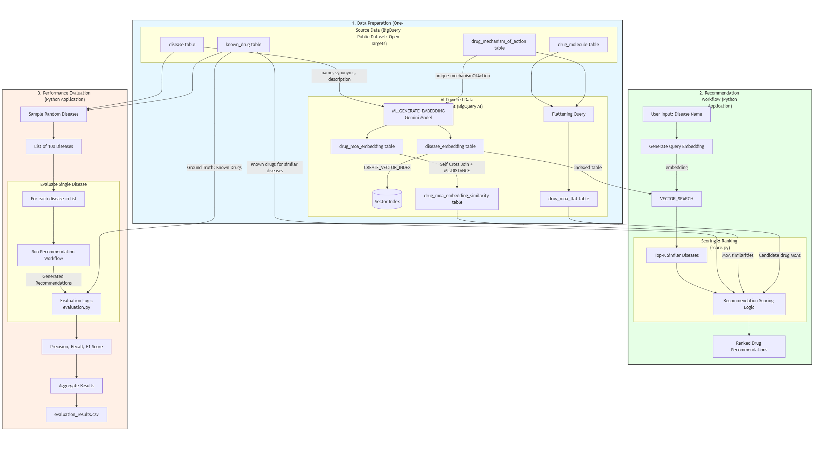

# ReDrugAI - Drug Repurposing Recommendation System



## Overview

**ReDrugAI** is an AI-powered drug repurposing recommendation system built on Google BigQuery and BigQuery AI. The system leverages machine learning embeddings and vector similarity search to identify potential therapeutic applications for existing drugs in new disease contexts.

### Key Features
- **Semantic Disease Similarity**: Uses vector embeddings to find diseases with similar characteristics
- **Mechanism-Based Scoring**: Recommends drugs based on mechanism of action (MOA) and target similarity
- **Comprehensive Evaluation**: Validates recommendations against known drug-disease associations
- **High Performance**: Achieves 45.44% combined recall rate in rediscovering established therapeutics

## Dataset

The system utilizes the **Open Targets Platform**, a comprehensive biomedical database containing:
- Drug-disease associations
- Molecular targets and mechanisms of action
- Disease embeddings 
- Accessible through BigQuery's public datasets

## Architecture

### BigQuery AI Features
- **ML.GENERATE_EMBEDDING**: Leverages Gemini embedding models for semantic vectors
- **VECTOR_SEARCH**: Native vector similarity functions for disease matching
- **bigframes.bigquery.create_vector_index()**: Optimized vector indices for efficient search

### Workflow
1. **Data Preparation**: Create embedding tables for diseases and drug mechanisms
2. **Similarity Computation**: Build similarity matrices using vector search
3. **Recommendation Engine**: Score candidate drugs based on therapeutic relationships
4. **Evaluation**: Validate against known drug-disease associations

## Prerequisites

### Google Cloud Setup
1. **BigQuery Project**: Project `redrugai` with dataset `redrugai_data`
2. **Vertex AI Model**: Set up remote vertex model for text embeddings
   - Follow: [BigQuery Text Embedding Guide](https://cloud.google.com/bigquery/docs/generate-text-embedding#console_1)
3. **Authentication**: Configure Google Cloud authentication

### System Requirements
- **Python**: Version >= 3.12.7
- **Operating System**: Windows/macOS/Linux
- **Memory**: Minimum 8GB RAM (16GB recommended)
- **Internet**: Required for BigQuery access

## Installation

### 1. Clone Repository
```bash
git clone <repository-url>
cd ReDrugAI-1
```

### 2. Create Virtual Environment
```bash
# Windows
python -m venv .venv
.venv\Scripts\activate

# macOS/Linux
python3 -m venv .venv
source .venv/bin/activate
```

### 3. Install Dependencies
```bash
pip install pandas numpy bigframes matplotlib google-cloud-bigquery
```

### 4. Google Cloud Authentication
```bash
# Install Google Cloud SDK
# https://cloud.google.com/sdk/docs/install

# Authenticate
gcloud auth login
gcloud config set project redrugai
```

## Usage

### Quick Start

#### 1. Open Main Notebook
```bash
jupyter notebook main.ipynb
```

#### 2. Run Drug Recommendation
```python
from score import recommend_for_disease_with_similars

# Example: Get recommendations for diabetes
results = recommend_for_disease_with_similars(
    disease_name="diabetes mellitus",
    similar_disease_names=["insulin resistance", "metabolic syndrome"],
    disease_drugs_df=disease_drugs_df,
    all_drugs_df=all_drugs_df,
    moa_pair_sim_df=moa_sim_df,
    top_overall=10,
    top_similar=5
)

print("Overall Recommendations:")
print(results["overall_recommendations"])
print("\nSimilar Disease Recommendations:")
print(results["similar_recommendations"])
```

#### 3. Run Evaluation
```python
from evaluation import run_disease_evaluation

# Evaluate system performance
evaluation_result = run_disease_evaluation(
    disease_name="diabetes mellitus",
    disease_drugs_df=disease_drugs_df,
    all_drugs_df=all_drugs_df,
    moa_pair_sim_df=moa_sim_df,
    disease_embedding_df=disease_embedding_df
)

print(f"Recall: {evaluation_result['metrics']['combined_recall']:.4f}")
print(f"Precision: {evaluation_result['metrics']['combined_precision']:.4f}")
```

## File Structure

```
ReDrugAI-1/
├── README.md                           # This file
├── main.ipynb                          # Main Jupyter notebook
├── score.py                            # Core recommendation engine
├── evaluation.py                       # Evaluation framework
├── evaluation_results.csv              # Benchmark results (100 diseases)
├── mermaid-diagram-2025-09-22-105141.png  # Architecture diagram
├── .venv/                              # Virtual environment
├── .git/                               # Git repository
└── .gitignore                          # Git ignore rules
```

## Core Components

### `score.py`
Main recommendation engine containing:
- `recommend_for_disease_with_similars()`: Primary recommendation function
- MOA similarity scoring algorithms
- Drug candidate filtering and ranking

### `evaluation.py`
Evaluation framework featuring:
- `run_disease_evaluation()`: Single disease evaluation
- `calculate_evaluation_metrics()`: Precision/recall calculation
- Leave-one-out cross-validation methodology

### `main.ipynb`
Comprehensive notebook with:
- Data preparation steps
- Interactive examples
- Visualization tools
- Performance analysis

## Evaluation Methodology

### Test Framework
The system uses a **leave-one-out cross-validation approach**:

1. **Holdout**: Remove known drugs from candidate pool for target disease
2. **Similar Disease Discovery**: Use vector embeddings to find related diseases (cosine distance < 0.3)
3. **Recommendation Generation**: 
   - Overall recommendations (top 10): Score all candidates against primary disease MOA/targets
   - Similar recommendations (top 5): Score similar disease drugs against primary disease
4. **Validation**: Compare recommendations against held-out known drugs using strict drug ID matching
5. **Metrics**: Calculate recall, precision, and F1-scores

### Performance Results
- **Combined Recall**: 45.44% (successfully rediscovers nearly half of known drugs)
- **Overall Recall**: 21.55%
- **Similar Recall**: 23.90%
- **Test Set**: 100 randomly sampled diseases
- **Validation**: Against Open Targets known_drug associations

## Key Insights

### Strengths
- **High Confidence**: 45.44% validation rate provides strong evidence for novel recommendations
- **Mechanistic Basis**: Recommendations based on proven MOA and target similarity
- **Cross-Disease Learning**: Leverages similar disease knowledge for better predictions
- **Scalable Architecture**: BigQuery AI enables large-scale vector search

### Novel Discovery Potential
The remaining 54.56% of recommendations represent high-confidence therapeutic candidates:
- Generated using same validated algorithmic logic
- Potential next-generation therapeutics
- Drug repurposing opportunities
- Alternative pathway targets


#### 4. Embedding Model Access
- Ensure Vertex AI API is enabled
- Check model permissions in Google Cloud Console
- Verify embedding model name matches deployment

## Contributing

1. Fork the repository
2. Create feature branch (`git checkout -b feature/amazing-feature`)
3. Commit changes (`git commit -m 'Add amazing feature'`)
4. Push to branch (`git push origin feature/amazing-feature`)
5. Open Pull Request

## License

This project is licensed under the MIT License - see the LICENSE file for details.

## Citation

If you use ReDrugAI in your research, please cite:

```bibtex
@software{redrugai2024,
  title={ReDrugAI: AI-Powered Drug Repurposing Recommendation System},
  author={[Your Name]},
  year={2024},
  url={https://github.com/[username]/ReDrugAI-1}
}
```

## Support

For questions and support:
- Open an issue on GitHub
- Contact: [your.email@domain.com]
- Documentation: See `main.ipynb` for detailed examples

## Acknowledgments

- **Open Targets Platform** for comprehensive biomedical data
- **Google BigQuery AI** for vector search capabilities
- **Vertex AI** for embedding model infrastructure

---

*ReDrugAI demonstrates the power of combining traditional pharmaceutical knowledge with modern AI capabilities to accelerate drug discovery and expand treatment options for diverse medical conditions.*
